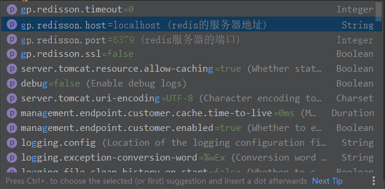
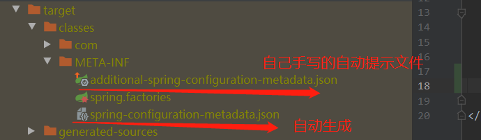

# 手写 Spring Boot Starter组件.md

加入配置文件自动提示
```
<!-- 加入配置文件自动提示，让使用此组件，在添加配置文件属性时候自动提示 -->
<!-- 加入好之后还需要增加additional-spring-configuration-metadata.json文件-->
<!-- additional-spring-configuration-metadata.json文件为解析文件的属性和配置-->
<dependency>
    <groupId>org.springframework.boot</groupId>
    <artifactId>spring-boot-configuration-processor</artifactId>
    <version>2.3.1.RELEASE</version>
</dependency>
```
targer下的META-INFO会有一个spring-configuration-metadata.json文件生成，说明我们的
additional-spring-configuration-metadata.json文件配置是正确的
------

additional-spring-configuration-metadata.json文件
> 备注：文件名固定，一个不能都不能差
```angular2
{
  "properties": [
    {
      "name": "gp.redisson.host",
      "type": "java.lang.String",
      "description": "redis的服务器地址",
      "defaultValue": "localhost"
    },{
      "name": "gp.redisson.port",
      "type": "java.lang.Integer",
      "description": "redis服务器的端口",
      "defaultValue": 6379
    }
  ]
}

```
> 解释
- name 为写的starter配置文件的属性配置项
- type 为属性配置项的类型
- description 为属性配置项的描述. 在使用组件添加配置文件时，显示的属性的描述
- defaultValue 为配置项的默认值



