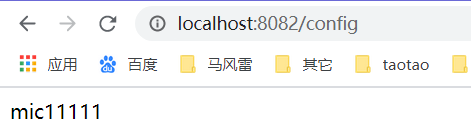

# Spring-Cloud-Config

注册中心地址
- http://localhost:9090

配置中心地址
测试 http://localhost:9091/user-service.properties


运行程序之间必须先启动 kafka,而kafka需要zookeeper,所以必须启动zookeeper + kafka


配置中心 config 端口号是9091


## 启动过程
- 第一步：启动 kafka + zookeeper
- 第二步：启动spring-cloud-eureka-server-9090，启动spring-cloud-config-server-9091，
    启动eureka之后报错提示Cannot execute request on any known server，是正常现象，
    因为eureka应用启动之后默认注册8761端口，而这个时候没有8761端口所以就会报错。
- 第二步：访问注册中心地址 http://localhost:9090
- 第二步：访问 http://localhost:9091/user-service.properties 此时读取的属性是从git上获取的


说明成功

而 上面的信息来源于git


然后在git上面更改配置，然后刷新地址spring-cloud-config-server-9091/src/main/resources/png/1.png 
就能看到刚才修改的信息，说明配置中心拉取到了最新数据

在配置中心config项目中出现如下日志：


访问  http://localhost:8082/config


成功说明从配置中心读取属性成功

```
@RefreshScope
@RestController
public class ConfigController {

    //Environement 去获得指定的配置.
    @Value("${hello}")
    private String txt;

    @GetMapping("/config")
    public String config(){
        return txt;
    }

}

```


http://localhost:9091/order-service.properties