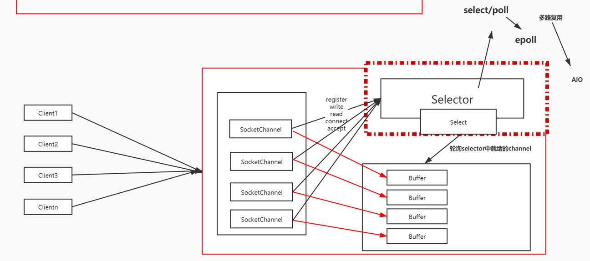

对于IO来说
如果两个客户端发送消息会发现，服务端只会收到一个客客户端发来的消息，另外一个没有收到，因为服务端io是一个注阻塞io，就算服务端用while，也无法处理多个，因为是在readLine阻塞的会但是while无法执行下去，所以要在循环里面用线程池异步去处理。但是当并发量很大的情情况下，线程池也会处理不来，处理不了的请求也会丢失，所以这个时候就不能用IO，只能用NIO，并发量处理不大的时候可以用IO处理

Nio里面三个很重要的
Channel管道   Buffer缓存去    Selector多路复用器

反转，因为同一个管道，读的数据要和写出去的数据相反，所以要反转​，把数据读取到的时候是往前叠加的，所以写出去的时候要从头开始所以要flip

非阻塞io默认是非阻塞的，要设置非阻塞

